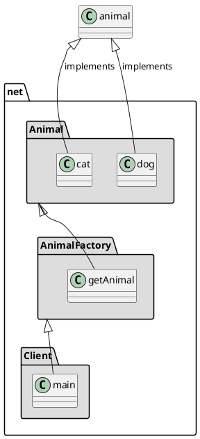

# 说明

## 工厂模式的特性
工厂模式中，我们在创建对象时不会对客户端暴露创建逻辑，并且是通过使用一个共同的接口来指向新创建的对象

## 举例

在jdbc的持久层中，只要提供方言，句柄以及驱动即可

## 说明

```plantuml
@startuml
 
namespace net.Animal #DDDDDD {
	.animal <|-- cat: implements
	.animal <|-- dog: implements
}

namespace net.AnimalFactory #DDDDDD {
	net.Animal <|-- getAnimal
}
 
namespace net.Client #DDDDDD {
	net.AnimalFactory <|-- main
}

@enduml
```
